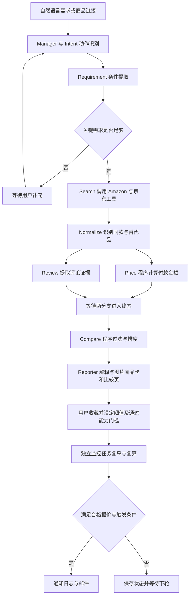
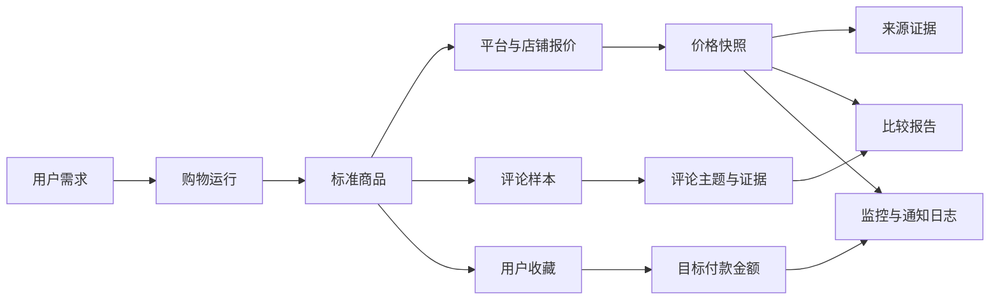
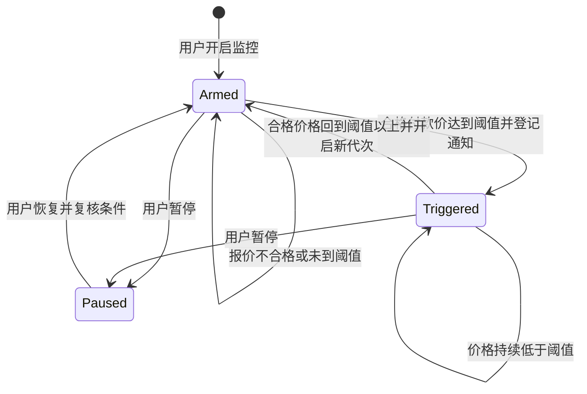

# 流程与页面参考图

全部为结构说明图，不代表已经实现的应用。支持 Mermaid 的 Markdown 阅读器可以直接渲染；不支持时可按文字流程与下方纯文本线框阅读，无需额外图片文件。

## 图 1：主线与可选并行



Day 1～3 先采用串行 Price → Review；图中的双分支是 Day 4 可选优化。无结果和分支失败按图编排文档降级，不无限等待。

## 图 2：数据如何连接



商品与报价是两层；价格快照是报价在某时刻的记录。监控的是明确规格和资格口径，不是一个模糊的标题。

## 图 3：页面线框（虚构演示数据）

```text
┌─────────────────────────────────────────────────────┐
│ PricePilot / 买值不值                     [演示模式] │
│ 预算 2000，通勤，戴眼镜，想要降噪好的头戴式耳机      │
│ [需求或商品链接____________________]  [开始分析]    │
│ 收货地区：已确认地区 X   会员资格：未知              │
├─────────────────────────────────────────────────────┤
│ ✓ 动作/条件  ✓ 两源搜索  ✓ 同款  ✓ 价格  ✓ 评论  ✓ 报告  │
├─────────────────────────────────────────────────────┤
│ 需求摘要：2000 元内 / 全新 / 大陆版 / 通勤 / 黑色     │
│                                                     │
│ [API商品图片或占位]
│ A：示例耳机 A / 大陆版 / 黑色 / 全新 / 标准套装       │
│ 综合首选                      当前付款：¥1,799       │
│ 商品价 1999 − 已核验店铺券 200 + 运费0 + 额外税费0   │
│ 本次核验来源中最低；未来可能返20，预计成本1779       │
│ 来源：演示来源甲 / 店铺一   核验时间：演示时点 T     │
│ 条件：有货 / 资格已确认 / 优惠可叠加规则已核验       │
│ [查看价格证据] [查看来源] [收藏] [设置目标价]         │
├─────────────────────────────────────────────────────┤
│                 A             B              C      │
│ 付款金额       1799          1599           1899     │
│ 通勤降噪       样本支持      样本支持       证据不足 │
│ 眼镜佩戴       样本支持      证据不足       样本支持 │
│ 主要不足       夏季闷热反馈  夹头反馈       通话一般 │
│ 证据入口       [展开]        [展开]         [展开]   │
├─────────────────────────────────────────────────────┤
│ 评论证据：去重后120条，8条提到眼镜佩戴舒适           │
│ 这是演示样本统计，不是全部买家的满意率               │
│ 历史价格：采样不足，暂不判断近期高低位               │
├─────────────────────────────────────────────────────┤
│ 我的收藏 A   目标付款 ≤ 1700 元   邮件：[未开启]     │
│ 上次核验：演示时点 T  [启用测试提醒] [暂停] [删除]   │
└─────────────────────────────────────────────────────┘
```

主金额始终是付款金额；返现信息使用次要位置。卡片不是只放一段模型回答，所有金额、条件和来源来自结构化报告。

## 图 4：提醒状态



通知发送失败的重试属于通知日志状态，不等同于再次跌价；不能通过反复重新布防来实现发送重试。

## V2 阅读图时要注意

双来源搜索不等于跨币种可比；价格合格集合按货币、目的地与规格区分。真实提醒还需要站点与来源许可，未启用时只展示收藏或模拟流程。图片区用 API 授权 URL，购买按钮使用后端选定链接。

## 参考代码：把阶段事件映射为可见进度（独立演示）

未来可用于前后端事件合同测试；阶段完成才显示完成，不提前伪造百分比或商品数量。

```python
STAGES = [
    "intent", "requirement", "search", "normalize",
    "price", "review", "compare", "reporter",
]

def progress_view(events):
    result = {stage: "pending" for stage in STAGES}
    for event in events:
        stage = event.get("stage")
        if stage not in result:
            continue
        if event["event_type"] == "stage_started":
            result[stage] = "running"
        elif event["event_type"] == "stage_completed":
            result[stage] = "completed"
    return result

view = progress_view([
    {"event_type": "stage_completed", "stage": "intent"},
    {"event_type": "stage_started", "stage": "requirement"},
])
assert view["intent"] == "completed"
assert view["requirement"] == "running"
assert view["search"] == "pending"
```
